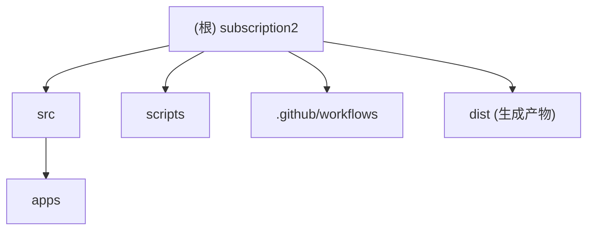

# CLAUDE.md

## 变更记录 (Changelog)

- 2026-06-11 10:52:42: 初始化项目 AI 上下文，建立根级索引、模块结构图与模块文档导航。

## 项目愿景

本仓库是一个基于 `@gkd-kit` 的 GKD 订阅项目，用 TypeScript 定义订阅元信息、全局规则、分类与应用规则，并通过脚本和 GitHub Actions 校验、构建和发布 `dist/gkd.json5` 订阅产物。

## 架构总览

- `src/subscription.ts` 是订阅聚合入口，导入分类、全局规则，并通过 `batchImportApps()` 自动加载 `src/apps` 下的应用规则。
- `src/categories.ts` 与 `src/globalGroups.ts` 维护订阅级分类和全局规则，目前均为空定义。
- `src/apps/*.ts` 每个文件对应一个 Android 应用的 GKD 规则定义。
- `scripts/check.ts` 执行 API 版本校验和订阅结构校验，`scripts/build.ts` 在校验后调用 `updateDist()` 生成发布产物。
- `.github/workflows` 提供 PR 校验、推送自动修复、主分支构建发布流程。

## 模块结构图

## 模块索引

| 模块 | 职责 | 入口/关键文件 | 本地文档 |
| --- | --- | --- | --- |
| `src` | 订阅源码核心，聚合订阅元信息、分类、全局规则与应用规则 | `src/subscription.ts`, `src/categories.ts`, `src/globalGroups.ts` | `src/CLAUDE.md` |
| `src/apps` | 按应用拆分的 GKD 规则定义目录 | `src/apps/*.ts` | `src/apps/CLAUDE.md` |
| `scripts` | 校验与构建订阅产物的 Node/TypeScript 脚本 | `scripts/check.ts`, `scripts/build.ts` | `scripts/CLAUDE.md` |

## 运行与开发

- 安装依赖：`pnpm install`
- 格式化：`pnpm run format`
- 代码修复：`pnpm run lint`
- 校验订阅：`pnpm run check`
- 构建产物：`pnpm run build`

运行环境要求来自 `package.json`：Node.js `>=22`，项目 Volta 配置为 Node.js `24.11.1`，包管理器为 `pnpm@10.31.0`。

## 测试策略

当前没有独立测试目录，主要质量门禁是 `pnpm run check`：

- `tsc --noEmit` 做 TypeScript 严格类型检查。
- `tsx ./scripts/check.ts` 调用 `checkApiVersion()` 与 `checkSubscription(subscription)` 校验订阅 API 与结构。
- PR 工作流额外限制一次 PR 中的订阅源码变更文件数不超过 1 个，并运行 `check`、`format`、`lint`。

## 编码规范

- TypeScript 使用 ESM、`strict`、`noUnusedLocals`、`isolatedModules`。
- Prettier 使用 2 空格、单引号、尾随逗号。
- ESLint 使用 `@eslint/js`、`typescript-eslint`、`eslint-config-prettier` 与 `eslint-plugin-unused-imports`。
- GKD selector 优先使用稳定属性如 `id`、`vid`、`text`、`desc`、`clickable`，仅在目标节点缺少稳定属性时使用层级关系。
- 修改订阅规则后优先运行 `pnpm run check`，必要时再运行 `pnpm run format` 与 `pnpm run lint`。

## AI 使用指引

- 只在 `src` 下维护订阅定义；不要手动编辑 `dist` 生成产物，除非明确需要发布产物。
- 应用规则应按包名放在 `src/apps/<package>.ts`，并使用 `defineGkdApp()`。
- 新增或调整 selector 时优先选择可快速查询的首个属性表达式，如 `text`、`text^`、`text*`、`text$`、`id`、`vid`。
- 对 WebView 或不稳定层级规则，应尽量补充文本、可点击状态或内容根节点上下文，避免纯固定层级路径。
- 本项目上下文索引记录在 `.claude/index.json`；重复初始化时优先更新缺口与模块快照。
